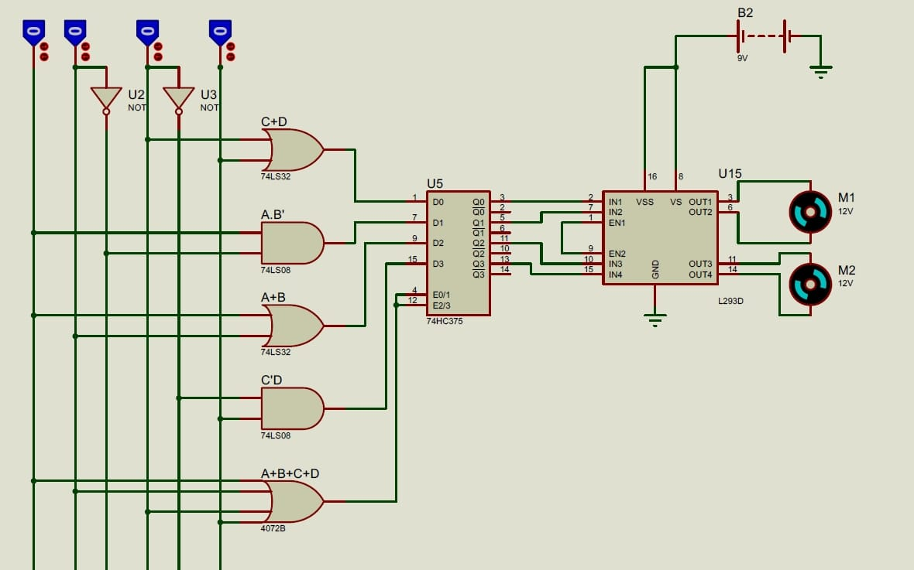
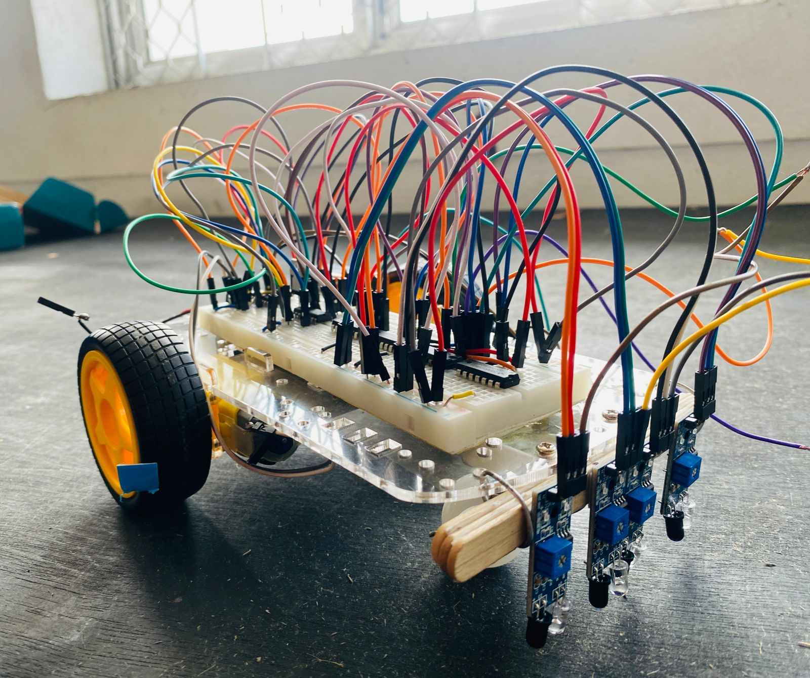

# line-following-robot-digital-logic_No-Microcontroller
This project demonstrates a line following robot control system implemented using only digital logic ICs (no microcontroller).

## Hardware Implementation

## 🔧 Hardware Implementation
The system is built using standard TTL logic ICs and discrete motor driver components:
- 74LS08 (AND Gate)
- 74LS32 (OR Gate)
- 4072B (4-Input OR Gate)
- 74LS75 (4-Bit D Latch)
- 74LS04 (NOT Gate)
- L293D Dual H-Bridge Motor Driver
- 5V Voltage Regulator
- Analog IR Sensors
- 3.7V Batteries
- DC Motors

## 🔍 Sensor Configuration

The robot uses **4 Analog IR sensors (A, B, C, D)** to detect the black line on a white surface.

- Logic `1` → Sensor detects black line  
- Logic `0` → Sensor detects white surface  

Sensor placement (Left → Right):

A  B  C  D

These inputs are processed through digital logic gates to generate motor control signals.

---

## 📊 Truth Table

| A | B | C | D | Left Motor | Right Motor | Function |
|---|---|---|---|------------|------------|----------|
| 0 | 1 | 1 | 0 | 10 | 10 | Going Forward |
| 0 | 0 | 0 | 0 | 10 | 10 | Keep Straight |
| 0 | 0 | 1 | 1 | 10 | 00 | Turning Right |
| 0 | 0 | 0 | 1 | 10 | 01 | Quick Turn Right |
| 1 | 1 | 0 | 0 | 00 | 10 | Turning Left |
| 1 | 0 | 0 | 0 | 01 | 10 | Quick Turn Left |

---

## ⚙️ Motor Control Logic

Motor outputs are represented as:

- `10` → Forward
- `01` → Reverse
- `00` → Stop

### Behavior Summary

- Center sensors active → Move forward
- Right sensors active → Turn right
- Left sensors active → Turn left
- Edge sensor active → Perform sharp correction

---

## 🧠 Working Principle

The 4 IR sensors continuously monitor the line position.  
Based on the sensor combination, combinational logic generates appropriate motor control signals.

This logic ensures:
- Stable forward motion
- Smooth turning
- Quick correction when deviating from the line

 

## 🖥 Proteus Simulation

## 🏁 Final Prototype

